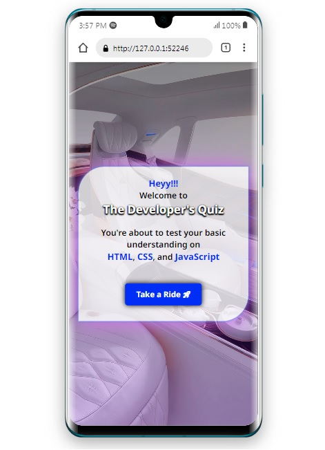
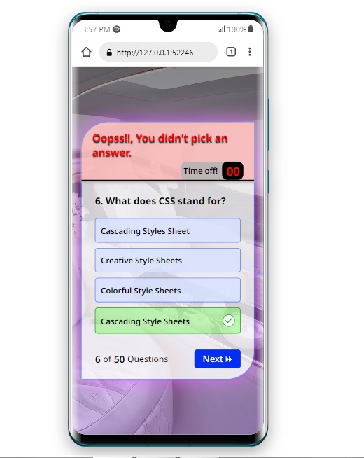
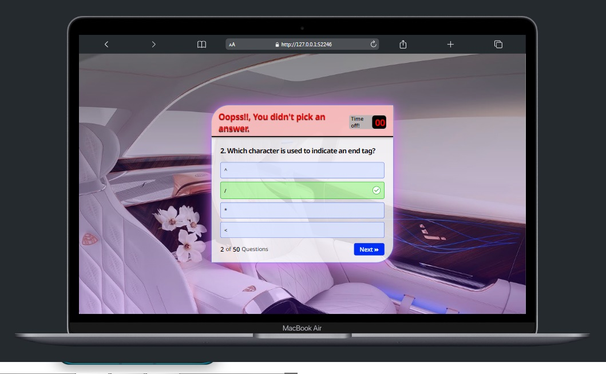

#### Developer's Quiz App.

## Overview
### 😄
- This one right here was an eye opening project, Had a lot of hard times figuring stuffs out, but alas, I,m still breathing 😄.
- Quite a task for me at this point, this. The stress ain't good but I'm loving it.😄
- It's a Web Application for developers (beginners especially).
- It provides you with series of quizzical questions to test your knowledge and understanding of the basic concepts around;
- HTML
- CSS and 
- JavaScript.
And it's a fun one, I fell in love while trying it out myself, don't trust me, 😄, but I bet you will too.

- Was built strictly on the basis of learning JavaScript, thanks to this cohort i'm in currently(as at the time of writing this).

## Previews on different viewports

## Built with

- HTML
- CSS
- JavaScript

## Links
- Project Live links:
- Netlify : [https://deft-arithmetic-18db21.netlify.app/]
- Github : [https://emmyjoel.github.io/Devs_Quiz_App/]

## Let's Connect Twitter 😃 

- Twitter : [https://www.twitter.com/Jay_n_Codes]

